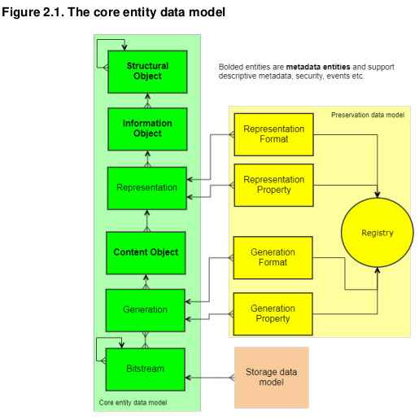

# Preservica - DSCA 


---
<!-- paginate: true -->

# Preservica Data Model

<div class="columns">
<div>  



</div>
<div> 

``` xml
<StructuralObject>
└── <InformationObject>
    └── <Representation>
        └── <ContentObject>
            └── <Generation>
                └── <Bitstream>
```

                
</div>
</div> 

---

# Top Layer

<div class="columns">
<div>  

- **Structural Object (Folder)**: Make up the hierarchy, can
contain other structural objects and/or information objects.  
- **Information Object (Asset)**: Assets are the logical entities which you will generally interact with.

</div>
<div> 

``` xml
<StructuralObject>
└── <InformationObject>
    └── <Representation>
        └── <ContentObject>
            └── <Generation>
                └── <Bitstream>
```

                
</div>
</div> 

---

# Layers within IOs

<div class="columns">
<div>  


- **Representation**: A way of viewing the information within an asset (ex. preservation copy and an access copy). All IOs always have the preservation representation.   
- **Content Object (CO)**: A logically atomic piece of content, for example an attachment on an email.  

</div>
<div> 

``` xml
<StructuralObject>
└── <InformationObject>
    └── <Representation>
        └── <ContentObject>
            └── <Generation>
                └── <Bitstream>
```

                
</div>
</div> 

--- 


# Layers within COs

<div class="columns">
<div>  


- **Generation**: Content objects contain generations, sequence of dated content. Only the most recent generation of content will be used by default
- **Bitstream**: The physical content as stored. A generation of a CO often has only one bitstream  

</div>
<div> 

``` xml
<StructuralObject>
└── <InformationObject>
    └── <Representation>
        └── <ContentObject>
            └── <Generation>
                └── <Bitstream>
```

                
</div>
</div> 


[Preservica Logical Data Model v6.9.0](assets/LogicalDataModel.pdf)


---

# Preservica data model overview
<div class="columns">
<div>  

Actionable entities via API calls:
- Structural Objects
    + Folder
- Information Objects
    + Asset
- Content Objects
    + File(s)
</div>
<div> 

Properties SO,IO,CO entities 
> - Ref
> - Title
> - Description
> - Parent (a link to another entity)
> - Security descriptor

</div>
</div>

---

# Preservica data model overview

``` xml
<StructuralObject>
└── <InformationObject>
    └── <Representation>
        └── <ContentObject>
            └── <Generation>
                └── <Bitstream>
```

                
---
# Preservica data model overview

<div class="columns">
<div>  

``` xml
<StructuralObject>
└── <InformationObject>
    └── <Representation> 
        └── <ContentObject>
            └── <Generation>
                └── <Bitstream>
```  

</div>
<div>  

```xml
'Folder'
'Asset'
-
-
-
'Files'
```
  
</div>
</div>

---
# Prep objects for Preservica packaging
- Arrange files in structure that matches post ingest structure

Structure 1

- ParentFolder (Folder) <span class="symbs">&#x21D2;</span> StructuralObject
    + processed (folder) <span class="symbs">&#x21D2;</span> StructuralObject
        - file.tiff <span class="symbs">&#x21D2;</span> InformationObject
        - file2.tiff <span class="symbs">&#x21D2;</span> InformationObject
    + orginal (folder) <span class="symbs">&#x21D2;</span> StructuralObject
        - file.tiff <span class="symbs">&#x21D2;</span> InformationObject
        - file2.tiff <span class="symbs">&#x21D2;</span> InformationObject
---

---
# Prep objects for Preservica packaging
- Arrange files in structure that matches post ingest structure

Structure 2

- TitleFolder (folder) <span class="symbs">&#x21D2;</span> InformationObject
    + preservica_preservation (folder) <span class="symbs">&#x21D2;</span> Representation
        - file.tiff
        - file2.tiff
    + preservica_presentation <span class="symbs">&#x21D2;</span> Representation
        - file.pdf
---

# Structure 1 vs Structure 2 

<div class="columns">
<div>

## Structure 1

- Structural Object = Parent Object
- Information Object for every Child Object
    + (generally one CO per IO)  
</div>
<div>

## Structure 2

- Information Object = Parent Object
- Content Object for every Child Object  

</div>
</div>


---
# How to 'assign' a structure 

---


# Preservica UI demo/overview

---
# Preservation or Access representation

```xml
<StructuralObject>
└── <InformationObject>
    └── <Representation>
        └── Preservation
        | └── <ContentObject>
        |       └── <Generation>
        |           └── <Bitstream>
        └── Access
            └── <ContentObject>
                └── <Generation>
                    └── <Bitstream>
```


---
# Preservation or Access representation

Are processed images different representations of the same entity?


---


# Structure(1,2) and Representations

Structure 1 - uses different Structural Objects 

```xml
<StructuralObject>
└── <InformationObject>
    └── <Representation>
        └── Preservation
        | └── <ContentObject>
        |       └── <Generation>
        |           └── <Bitstream>
        └── Access
            └── <ContentObject>
                └── <Generation>
                    └── <Bitstream>
```


---


# Security tag
---
